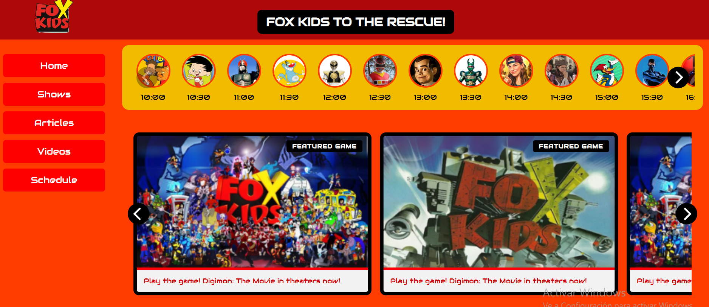

Fox Kids Streaming Site
Overview
A retro-themed website inspired by Fox Kids Latin America from the early 2000s. It features:

🔴 A red banner at the top with the Fox Kids logo and a slogan.

📂 A left sidebar with large buttons: Series, Juegos, Artículos, Videos, Programación.

🕘 A round schedule gallery displaying 24 show icons (100×100 px), scrolling horizontally with arrows.

▶️ An embedded YouTube video (“AHORA EN PANTALLA”).

🎞️ Multiple vertical image galleries for SUPER SENTAI, INVASIÓN ANIME, LIVE ACTION, COMEDY, etc.

📰 Newly added 'Artículos' section featuring article cards that link to individual full article pages.

🧩 Key Features
1. Retro Aesthetic
Bold orange/red color scheme.

Large, chunky sidebar buttons.

Stylized Audiowide font for headings and labels.

2. Left Navigation Bar
Big rectangular red buttons with white text.

Hover state turns text yellow.

Categories: Series, Juegos, Artículos, Videos, Programación.

3. Round Schedule Gallery
Displays 10 circular thumbnails at a time (100×100 px).

Scrolls one item at a time.

24-hour loop: wraps to the start after last item.

4. YouTube Embed — “AHORA EN PANTALLA”
Black box styled with red border.

Plays a featured video clip (e.g. Digimon, Power Rangers intros).

5. Vertical Image Galleries
Horizontal carousel: 5 visible items per row.

Themes: SUPER SENTAI, INVASIÓN ANIME, COMEDY, etc.

Posters sized (e.g., 280×420) to match screen width.

Looping, one-by-one scroll with left/right arrows.

6. New Article Pages ✍️
New navigation section “Artículos” replaces old “Concursos” tab.

Main page (articles.html) shows horizontal Flickity-style carousel of featured articles.

Each article links to a dedicated subpage (article01.html to article06.html).

Full articles include:

Responsive hero image (recommended size: 1000×562 px or 16:9 ratio)

Proper use of <strong> for anime titles

Site: https://foxkids-tribute.netlify.app/

![Fox Kids Streaming Site Preview]

